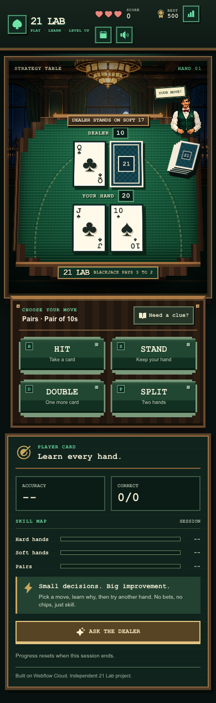
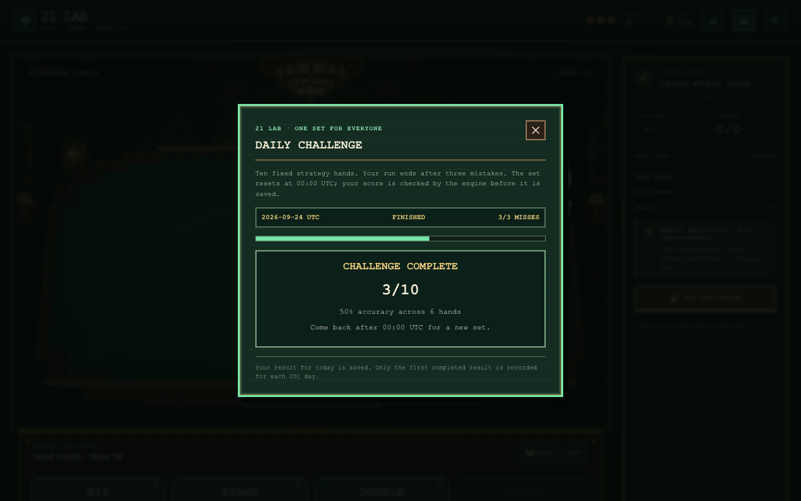
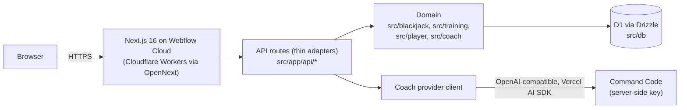

# 21 Lab

**Learn blackjack strategy by playing, not by reading.**

Live: **https://lab21.webflow.io/**

21 Lab is an educational blackjack strategy trainer. You play real hands against a dealer, and every decision is graded against a deterministic basic-strategy engine — not a model's guess. There is no real money, no betting, and no chips: it's a training tool, not a casino. An AI coach can explain *why* a move was right or wrong, backed by the same engine and by simulated expected value, and the app works fully even when the AI is unavailable.

Built for the Nerdearla 2026 Webflow App Challenge (target categories: Best Tech, Best Design, Best in Show).

## Screenshots

| Mobile table | Daily Challenge |
|---|---|
|  |  |

## Try it in 30 seconds

1. Open https://lab21.webflow.io/ — you're already at the table, no sign-up, no landing page.
2. Play a hand: pick hit, stand, double, or split. You get instant feedback ("Perfect move" / "Not quite").
3. Tap **Skill Map** to see your accuracy by hand type, streaks, and badges.
4. Tap **Daily Challenge** for a fixed ten-hand set that's the same for everyone that day.
5. After a miss, tap **Why?** for a streamed AI explanation with an EV bar chart, or open **Ask the dealer** to chat about your stats.

## Features

| Feature | What it does | Where in code |
|---|---|---|
| Practice table | Deals hands, grades every decision against basic strategy | `src/features/pixel-casino/`, `src/features/practice/usePracticeSession.ts` |
| Run mode | 3 lives, combo multiplier, mistake shake/vibration, dealer hole-card flip | `src/blackjack/resolve.ts`, `src/features/pixel-casino/` |
| Skill Map | Per-category accuracy, streaks, strongest/weakest spot, badges | `GET /api/stats`, `src/player/playerStats.ts`, `src/player/achievements.ts` |
| Adaptive weakness practice | Optional toggle that re-weights scenario generation toward weak categories | `src/training/weights.ts` |
| Daily Challenge | Ten fixed hands per UTC day, same for every player, graded server-side | `src/training/dailyChallenge.ts`, `src/app/api/daily/` |
| AI coach — "Why?" | Streamed explanation + EV bar chart after a mistake | `src/app/api/coach/evidence/route.ts`, `src/coach/stream.ts` |
| AI coach — "Ask the dealer" | Free-form chat grounded in the player's own stats and hand evidence | `src/app/api/coach/stream/route.ts` |
| Coach quota counter | Visible "N/20 AI questions left today" | `src/app/api/coach/usage/`, `src/coach/rateLimit.ts` |
| Template fallback | Short rule-based explanations when the AI is off or unavailable | `src/blackjack/explain.ts` |
| Anonymous identity | Long-lived UUID cookie, no auth, no personal data | `src/player/playerCookie.ts`, `src/player/playerId.ts` |

## Tech highlights (Best Tech)

**The LLM never decides strategy.** Every "correct move" comes from a deterministic basic-strategy engine (`src/blackjack/strategy.ts`, `optimalAction()`), and every Daily Challenge submission is re-graded server-side from the persisted hand set — the client's reported score is never trusted (`gradeDailyResult` in `src/training/dailyChallenge.ts`).

**EV by simulation, not by claim.** `simulateEV()` (`src/blackjack/simulate.ts`) runs a Monte Carlo simulation per action so the "Why?" chart shows a number the engine actually computed.

**The AI coach only calls grounded tools.** `src/coach/stream.ts` wires three tools into the Vercel AI SDK's `streamText`: `get_optimal_action`, `simulate_ev`, and `get_player_stats` — each backed directly by the engine or by the player's persisted stats. The system prompt instructs the model to use only supplied evidence and tool results, never invented numbers.

**The app works without AI.** If the Command Code key is missing or the provider fails, the UI falls back to the template explanations in `src/blackjack/explain.ts` — no feature depends on the LLM being reachable (D7).

**Coach quota is atomic and fair.** `reserveCoachCall()` (`src/coach/rateLimit.ts`) does a single conditional upsert in SQLite (`INSERT ... ON CONFLICT DO UPDATE SET count = count + 1 WHERE count < limit`), so concurrent requests from the same player can't over-spend the daily limit. If the provider fails before any text is streamed, `releaseCoachCall()` refunds the reserved question, and `GET /api/coach/usage` powers a visible remaining-questions counter.

**Daily Challenge is deterministic and tamper-resistant.** Each of the ten hands is generated from a per-hand seed derived from `daily-v1:<date>:<index>` (`generateDailyScenarios` in `src/training/dailyChallenge.ts`), persisted once in D1 as the canonical set for that day, and graded server-side against that exact set. Results are stored with `onConflictDoNothing()` — the first submitted result for a player/day wins (`src/db/dailyRepository.ts`).

**No accounts, no PII.** Players are identified only by a long-lived, `httpOnly` UUID cookie (`lab_player`); a tampered or missing cookie is treated as absent and a fresh id is minted, never trusted as-is (`src/player/playerCookie.ts`).

**The provider key never reaches the client.** `COMMAND_CODE_API_KEY` is a Webflow Cloud secret environment variable, read only inside server-side route handlers.

## Architecture



| Path | Responsibility |
|---|---|
| `src/blackjack/` | Pure domain: cards, hands, rules, basic-strategy tables, Monte Carlo EV. No framework imports. |
| `src/training/` | Scenario generation, adaptive weighting, Daily Challenge seeding and grading. |
| `src/player/` | Anonymous identity, decision recording, stats, achievements. |
| `src/coach/` | LLM client, tool definitions, prompt, rate limiting. |
| `src/db/` | Drizzle schema and D1 repositories. |
| `src/app/` | Routes, UI, and API route handlers — validate input, call the domain, persist, respond. |
| `src/features/` | Client-side UI: the pixel-art casino screen and the practice session hook. |

`src/blackjack` and `src/training` are pure TypeScript with no framework imports, developed test-first. The main API routes (`daily`, `decisions`, `stats`, `coach/stream`, `coach/usage`) are thin adapters over an injectable `handler.ts` — the handler takes its dependencies (a repository interface, clock, cookie reader) as arguments, so the routing logic is unit-tested without a real request or database.

## Stack

| Layer | Choice | Version |
|---|---|---|
| Framework | Next.js (App Router) | 16.3.6 |
| Runtime | Cloudflare Workers via OpenNext | `@opennextjs/cloudflare` 1.20.6 |
| Database | Cloudflare D1 (SQLite) | via `wrangler` 4.137.0 |
| ORM | Drizzle | `drizzle-orm` 0.45.3 |
| AI | Vercel AI SDK + OpenAI-compatible provider | `ai` 7.0.113, `@ai-sdk/openai-compatible` 3.0.55 |
| UI | React, Tailwind CSS, Motion, Phosphor Icons | React 19.2.8, Tailwind 4 |
| Validation | Zod | 4.6.5 |
| Tests | Vitest | 5.0.1 |
| Language | TypeScript | 5 |

## Run locally

```bash
npm install
npm test          # Vitest unit suite
npm run dev        # Next.js dev server (no D1/Cloudflare context — coach and persistence degrade)
```

For the full runtime, including D1 and the coach:

```bash
npm run db:migrate:local   # apply Drizzle migrations to the local D1 database
npm run cf:preview          # build with OpenNext and preview under Wrangler
```

Environment variables (Webflow Cloud secrets/vars, not committed):

| Variable | Required | Purpose |
|---|---|---|
| `COMMAND_CODE_API_KEY` | For AI features | Server-side secret for the Command Code provider |
| `COMMAND_CODE_MODEL` | Optional | Model id passed to the OpenAI-compatible client |

## Testing

Domain code (`src/blackjack`, `src/training`) is developed test-first with strict TDD. API route handlers are unit-tested with injected dependencies rather than a live database.

```bash
npx vitest run
```

Observed: **563 tests passing** across 56 test files.

## Deploy

Deployed to Webflow Cloud (Cloudflare Workers), D1 migrations applied automatically on deploy:

```bash
npx @webflow/webflow-cli apps deploy --no-input --site-id <site-id> --mount / --environment main --skip-mount-path-check --skip-update-check
```

`basePath` / `assetPrefix` are intentionally left unset in the Next.js config — Webflow Cloud injects the mount path at build time.

## Decisions & scope

| Decision | Why |
|---|---|
| Blackjack only, no poker | Poker strategy modeling was too large for the timeline |
| Strategy decided by a deterministic engine, never the LLM | Correctness must be demonstrable |
| Coach only calls engine/stats-backed tools | "The AI never guesses, it runs the numbers" |
| Anonymous players, no auth | Zero friction — a judge can play within 30 seconds |
| Per-player daily coach rate limit | The provider key is paid by the author |
| App must work fully without the AI | The AI is an enhancement, not the core |
| Opens directly into a playable hand, no landing page | "The game is the onboarding" |

**Leaderboard intentionally deferred.** Anonymous, cookie-based identities can't enforce one entry per person, so a leaderboard would be trivially gameable; it was cut rather than shipped as something misleading.

---

Built for the Nerdearla 2026 Webflow App Challenge. Independent project — not affiliated with Webflow beyond using its platform.
